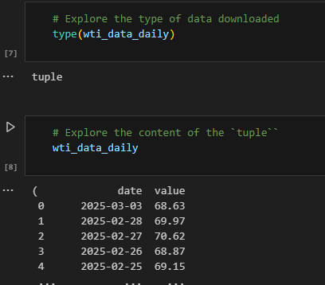
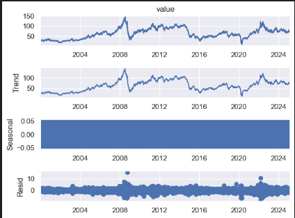
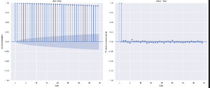
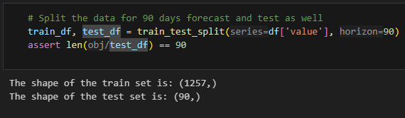

# Time-Series-Analysis-and-Forecasting-with-Dash-Web-App
This repository captures a project to carry out time series analysis and forecasting which is then deployed to production as a Plotly Dash App. The dataset to be analysed and model is crude oil prices - both West Texas Index (WTI) and Brent. 

**Problem Statement:** 
A time series analysis and forecasting app to be developed to assist an oil and gas producing company make data-driven investment decision for the drilling and subsequent sales of crude oil. 

> Given historical crude oil prices, can we forecast into different future horizons what the price might be? 

## Table of Contents
1. [Project Overview](#project-overview)
2. [Project Structure](#project-structure)
3. [Technology Stack](#tech-stack)
4. [Data Preparation](#data-preparation)
5. [Model Training](#model-training)
6. [Model Evaluation](#evaluating-multiple-models)
7. [Deployment](#deployment)
    - [Web Dash App](#Dash-app)
8.  [Update Workflows](#update-workflows)
9. [Usage](#usage)
10. [Contributing](#contributing)
11. [License](#license)
12. [Acknowledgments](#acknowledgments)


## Project Overview
The time series analysis and forecasting app to be developed is to assist an oil and gas producing company make data-driven investment decision for the drilling and subsequent sales of crude oil. As the return on investment (ROI) are driven by crude oil prices, an ongoing review of price trends and ability to forecast its direction would be highly beneficial to such organisation. This should decide if and when to drill and possible periods that the best price can be gotten from the crude oil sales.

The following are objectives of the project:

* Create a Extraction, Transformation and Loading (ETL) pipeline for data sourced using the Alpha Vantage API.
* Carry out a time series exploratory data analysis to uncover the characteristics of the dataset
* Based on the EDA experiment with relevant Time Series Forecasting models and tune hyperparameters accordingly for best results.
* Deploy the forecasting model into a production environment. 
* Utilised a modular programming structure using OOP
* Build the dashboard as a Plotly Dash App 
* Deployed the Dash App in a custom domain Flask Web App

  
## Project Structure
```

├── assets
├── artifacts
|   ├── data_ingestion
|   |   ├──WTI
│   |   ├──Brent
│   ├── data_transformation
│   │   ├──WTI 
│   │   ├──Brent 
│   ├── best_model.pkl
├── logs
├── notebooks
|   ├──ETL_EDA_Modelling_Experiment.ipynb
├── src
|   ├── __init__.py
│   ├── components
│   │   ├── __init__.py
│   │   ├── data_ETL.py
│   │   ├── data_transformation.py
│   │   ├── model_training.py
│   ├── config
│   │   ├── __init__.py
│   │   ├── config_entity.py
│   │   ├── config.yaml
│   │   ├── configuration.py
│   │   ├── params.yaml
│   ├── constants
│   │   ├── __init__.py
│   ├── pipeline
│   │   ├── __init__.py
│   │   ├── stage_01_data_ETL.py
│   │   ├── stage_02_data_transformation.py
│   │   ├── stage_03_model_training.py
│   │   ├── stage_04_prediction_pipeline.py
│   │   ├── exception.py
│   │   ├── forms.py
│   │   ├── logger.py
│   ├── notebooks
│   ├── static
│   │   ├──vendor
│   │   |   ├──bootstrap
│   │   |   ├──aos
│   │   |   ├──glightbox
│   │   ├──main.css    
├──utils
│   │   ├── __init__.py
│   │   ├── common.py
├── tests
│   ├── function_class_test.py
├── venv
├── __init__.py
├── .env
├── .gitignore
├── app.py
├── main.py
├──  README.md
├── requirements.txt


```
## Tech Stack
### Dependencies
```
- dash
- plotly
- pandas 
- numpy
- alpha_vantage
- dash_bootstrap_components
- jupyter
- python-dotenv
- seaborn
- matplotlib
- statsmodels
- scikit-learn
- arch
- prophet
- python-box
- dill
- Github (action)

```
### Step-by-Step Implementation
**Create a python virtual environment and activate it :**
    ```
    conda create -p <path/to/virtual_environment>
    conda activate <path/to/virtual_environment>    
    ```
 **Install the required packages:**
    ```
    pip install -r requirements.txt
    ```

## Data Preparation
### Data Sources
- To forecast using current data, an API was used for the Extract pipeline. Alpha-Vantage provide this API for daily, weekly and monthly prices of stocks and commodity.

- The prices of Crude Oil (West Texas Intermediate- WTI and Brent) was used for the analysis and modelling.

- An API key is granted free from Alpha-Vantage with a daily limit to the amount of API calls. This limit was adequeate as the ETL pipeline developed need to download data only once per day. The API key is hidden within the project's environment variables and loaded as a configuration.

### Data Cleaning, Preprocessing and Transformation
The following steps were carried out of this dataset to clean and transform it for use:

- Extraction:
    * The dataset served by the API was in the form of a Tuple of DataFrame contained the timestamped values. Thus the first step was to extract the DataFrame from the Tuple (see figure 1).
      
    
  
    Figure 1. Tuple with DataFrame of time series data
  
- Transform Index to DateTime:
    * The index of Dataframe was an `object` data type which required transformation to `DateTime`.
- Remove wrong / bad data:
    * There were observed instances of `.` as values in the data. This wrongly presented that data as not having missing values. This was removed to create missing values that can be imputed.
- Missing values
    * The missing values created from bad data was imputed using `backfill`
- Transform `value` columns data type:
    * The `value` column was transformed to float to depict prices and any negative or zero values dropped.

The final clean and transformed data was loaded into a CSV file for further use.

As there would be a lot of experimentation to be done, the spliting of time series into train, validation and test sets was left to be done at each stage of training models rather than have a transformation pipeline for this.
        
### Time Series Exploration Data Analysis 
- Basic EDA
This involved exploring the content of the dataset using standard methods - `.head()`, `.tail()`, `.info()`, `.isna().sum()`, `describe()`.

Plot of  `histogram` and `boxplot` 

These revealed the data cleaning and transformations required as detailed above.

- Time Series EDA
A line plot visualization of the time series was to reveal that The price was mostly with low volatilty until year 2000 from where an upward trend started to become noticable. The analysis  horizon was then set to year 2000 to 2025. 

Together with smoothing (rolling average) for mean and standard deviation we could visually see that :
* there was an upward trend in the prices
* The data did not look statinary (no constant mean)
* Needed to go granular or statistical to identify seasonality.
* There was visible periods of price fluactuations which collides with global economic shocks of 2008 (financial meltdown), 2016 (shale oil boom), 2020 (Covid) and 2023 (Russia-Ukraine war)

These was all further confirmed programmatically  with:
* `seasonal_decompose()` (Seasonal Decomposition)
* `month_plot()`, `quarter_plot()` (Seasonal Decomposition)
* Dickey-Fuller test -`adfuller()` (stationality)
  


* ACF and PACF -`plot_acf()`, `plot_pacf()` (autoregression and errors of lags- stationality & seasonality)



The final EDA position was that from the observed trends in the original data and the rolling mean, we can conclude that the time series is non-stationary in line with visual EDA. 
 
 A stationary time series should have a constant mean and variance over time, which is not the case here. We had a non-constant mean showing an upward trend .
 
 There was a mild seasonal fluctuation in the price of crude oil (WTI). The price spikes seen in 2008 and 2020 are easily explained by the global financial crisis of 2008, the discovery of shale oil in 2015/2016, and Covid-19 in 2020. The initial rise in 2022 can be ascribed to the Russia-Ukraine conflict with prices subsequently falling.


## Model Training
### Model Selection
The process of selecting a model type was iterative by experimenting on the classic time series models. The results and evaluation of each model and its configuration tested formed the basis for further experimentation with more configurations, types or another model entirely.
Models used were:
* Exponential Smoothing (Holt Winters)
* ARIMA, SARIMA 
* GARCH
* PROPHET

### Training the Model
- Loading the Data
Firstly, we load the dataset using the ETL pipeline created:
    * Training Data: Used to train the models.
    * Validation Data: Used to tune and validate the models during the training process.
    * Test Data: Used to evaluate the final model's performance.
- Splitting the Data
Split of the dataset for each model experimented with is based on the DateTime Index. Majorly, we created a training and test set. The target was to have a model that would forecast crude oil prices for the next quarter (90 days). However, this was a dynamic option as we ticked as I worked I on:
 Example split:

 

* Exponential Smoothing (Holt Winters):
The simple Exponential Smoothing, Double Exponential Smoothing and Triple Exponential Smoothing were all experimented with using both additive and multiplicative configuration.
The Holt-Winters method has three variations:
1. **Additive**: Suitable for time series with constant seasonal variations.
2. **Multiplicative**: Suitable for time series with seasonal variations that change proportionally with the level of the time series.
3. **Damped**: Suitable for time series with trends that gradually decrease over time.

The method uses three smoothing equations:
- **Simple** - ***Level***: Captures the overall level of the series. 
- **Double** - ***Trend***: Captures the trend (increasing or decreasing pattern) of the series.
- **Triple** - ***Seasonality***: Captures the repeating seasonal pattern.

The Simple exponential smoothing (SES) model returned the same value for the forecast as expected. SES does not model trends or seasonality.
It assumes the best guess for the next value is the current smoothed level, which remains constant unless new observations significantly change it.

Double Exponential Smoothing adds another layer that handles trends in data - There was a slow upward trend predicted which is line with the test set trend even though the volatility is not captured by the forecast. The multiplcative trend is has a negative gradient while the additive trend is growing.

Triple Exponential Smoothing- The EDA showed a small  amount of seasonality in the data and this was amplified by the TES which tried to model the seasonality and trend, but not able to model this adequately.

It became apparent that the Holt-Winters is not able to model the complexity of the crude oil price data. 
 
 One of the limitation of Holt-Winters is that it does not have room for regressors so external factors cannot be considered. Crude oil prediction is complex as it is affected by myriad of external factors such

 * Supply and Demand
 * Geopolitical Events e.g. Russia-Ukraine conflict
 * Economic Indicators
 * Exchange Rates
 * Inventory Levels
 * Technological Advances e.g. shale oil production in the US.
 * Market Speculation etc.

 While we expected ARIMA, SARIMA to also struggle with this data set having non-seasonal variability (peaks and dips) from external events, we explored further with them.

* ARIMA, SARIMA 
- Hyperparameter selection: Based on the ACF and PACF plots done during EDA, ARIMA(1, 1, 0) was first experimented with to have a base model for comparison. This model fitted well but there was apparent concerns with the residuals normality and heteroskedasticity. 

`Residuals Normality:` This refers to whether the residuals (errors) from the model follow a normal (bell-shaped) distribution. Non-normal residuals may indicate that the model is missing something or that the assumptions of the analysis are not fully satisfied.

`Heteroskedasticity:` This occurs when the variance of the residuals is not constant over time. In other words, the spread of the errors changes at different levels of the independent variable(s), which can affect the reliability of the model's predictions.

Both issues suggest that while the model fits well, there could be underlying problems. The external shocks  to oil price shown in the EDA are likely to be the culprit here for the outlier values.

Hyperparameter tuning was implemented for different values of p, d, q , P, D, Q, s:
`p:` The number of past observations (lags) used in the model (non-seasonal autoregressive terms). This is as how much the past directly influences the present.

`d:` The number of times the data is differenced to make it stationary (non-seasonal differencing).

`q:` The number of past forecast errors (residuals - direct & indirect influences) included in the model (non-seasonal moving average terms).

`P:` The number of seasonal past observations (lags) used in the model (seasonal autoregressive terms).

`D:` The number of times seasonal differencing is applied to remove seasonal trends (seasonal differencing).

`Q:` The number of seasonal past forecast errors (residuals) used in the model (seasonal moving average terms).

`s:` The periodicity or length of the seasonal cycle (e.g., 12 for monthly data with yearly seasonality)

The `SARIMA`results models the volatility in the data better than `ARIMA` which were almost straight lines for the mild seasonality effects. Thus, justifying the need to use more complex models that account for external or exogenous factors like `SARIMAX` or `PROPHET`. But before this we modelled  for the volatility using `GARCH` and then combine with the `SARIMA` model for forecasting.

* GARCH, GARCH+SARIMA
The `GARCH` model was built using both the differenced value and the residuals from an ARIMA model. After experimenting with these and `GARCH(3,2)` and `GARCH(1,1)`, the results favoured using `GARCH(1,1)` as it is simpler, had better AIC/BIC and all the parameters were statistically significant (p-value <0.05).

This revealed the best practice for GARCH Modeling in respect of using "diff" vs "resid"

- *"diff" (differenced series)*: Use GARCH directly if the series is simple with no strong autocorrelation; assumes constant mean (mu ≈ 0.06 in GARCH(1,1), p ≈ 0.08).  
  - **Pros**: Simpler, one-step.  
  - **Cons**: Misses mean dynamics (e.g., AR/MA from SARIMA).  
- *"resid" (SARIMA residuals)*: Use two-step approach (SARIMAX + GARCH) for complex series.  
  - SARIMAX(3,1,2) removes autocorrelation (Ljung-Box p = 1.00), leaving residuals (mu ≈ 0, p = 0.934) for GARCH to model volatility (persistence = 0.9845).  
  - **Pros**: Separates mean and variance.  
  - **Cons**: More steps. 

- *Recommendation*: SARIMAX + GARCH(1,1) on "resid" was best here, given significant AR/MA terms and heteroskedasticity (kurtosis = 8.71).  

-Selecting best ARIMA / SARIMA model: the AIC/ BIC metric was used to select best model with the model with the lowest value for these selected.
* `AIC (Akaike Information Criterion):` A measure of model quality that balances fit and complexity. Lower AIC values indicate better models, as they suggest a good fit to the data with minimal unnecessary parameters. However, it penalizes overly complex models to avoid overfitting.

* `BIC (Bayesian Information Criterion):` Similar to AIC but applies a stronger penalty for the number of parameters in the model. It is often preferred when you aim for simpler models, as it tends to select models with fewer parameters.

* PROPHET
Facebook Prophet works well in taking care of the complexity of external factors such as that witnessed with crude oil prices.

A additional transformation step was required to rename the time series data column name to that standard required by `Prophet`. index named as `ds` and values (prices) as `y`. 

The basic configuration of the `Prophet` model was able to identify the complex pattern in the crude oil (WTI) data. However, further experiments using the crude oil (Brent) data resulted in predicting negative values thus necessitating carrying out hyperparameter tuning with cross-validation.

For cross-validation the rolling forecast method was utilised: 
`Rolling Cross-Validation` expands the training data with each iteration, making it cumulative.

`Sliding Cross-Validation` keeps both training and validation data sizes fixed, sliding forward through the time series.

These methods ensures that future data is never used to predict past outcomes, preserving causality.

The best model is selected from the process of hyperparameter tuning and cross-validation. This model is then saved for forecasting in the dash app. 


### Evaluating Multiple Models
All the models trained as detailed above were evaluated to assess individual performance as well as compare models against each other.  

Each model was tested using the training and validation data. The Time Series models have a `summary` report that details several metrics for its evaluation. While some of these have been explained earlier (AIC/ BIC) the table below provides the main metrics and how they are interpreted.

| **Metric**                 | **Definition**                                                                                 | **Interpretation**                                                                                          |
|----------------------------|---------------------------------------------------------------------------------------------|------------------------------------------------------------------------------------------------------------|
| **Log-Likelihood**         | A measure of how well the model fits the data. It evaluates the probability of observing the data under the model's parameters. | Higher values indicate better model fit. Compare across models with the same structure for evaluation.     |
| **AIC**                    | Balances model fit and complexity by penalizing models with more parameters.                | Lower AIC values indicate a better trade-off between fit and simplicity. Useful for model comparison.      |
| **BIC**                    | Like AIC but applies a stronger penalty for the number of parameters.                       | Lower BIC values favor simpler models, useful when simplicity is prioritized in model selection.           |
| **HQIC**                   | A criterion like AIC and BIC but more conservative for large datasets.                      | Lower HQIC values indicate a better-fitting model, balancing fit and simplicity conservatively.            |
| **Ljung-Box (L1) (Q)**      | A test for autocorrelation in residuals. Measures whether residuals are independent across time. | A small value (e.g., 0.00) suggests no significant autocorrelation in residuals.                           |
| **Prob(Q)**                | The p-value associated with the Ljung-Box test.                                             | A high value (e.g., 1.00) indicates residuals likely have no autocorrelation.                              |
| **Jarque-Bera (JB)**       | A test for residuals' normality based on skewness and kurtosis.                             | A large value (e.g., 1928.49) suggests the residuals deviate significantly from normality.                 |
| **Prob(JB)**               | The p-value associated with the Jarque-Bera test.                                           | A low value (e.g., 0.00) indicates strong evidence of non-normality in residuals.                          |
| **Heteroskedasticity (H)** | Measures whether residuals have constant variance (homoskedasticity).                      | A value close to 1.0 suggests homoskedasticity. A value significantly different indicates heteroskedasticity.|
| **Prob(H) (two-sided)**    | The p-value for the heteroskedasticity test.                                                | A high p-value (e.g., 0.14) suggests residuals likely have constant variance.                              |
| **Skew**                   | Measures asymmetry in the residuals' distribution.                                          | A negative value (e.g., -0.81) indicates a left-skewed distribution; positive values indicate right skewness.|
| **Kurtosis**               | Measures the "tailedness" of the residuals' distribution.                                   | High values (e.g., 8.71) indicate heavy tails, suggesting non-normality.                                   |

In addition, the basic regression evaluation metrics - Mean Absolute Error (MAE), Mean Squared Error (MSE), Root Mean Squared Error (RMSE) and Mean Absolute Percentage Error (MAPE) were utlised to assess prediction performance against validation data. 

 
- Selecting the Best Model
Looked at the performance scores from the `Prophet` models and choose the one with the highest `mae` score. 
- Saving the Best Model
Once the best model is identified, it is saved to a file to be used later to make predictions.

 

## Deployment
### Dash App in Flask Web App
- The Flask web framework was used to share the web application for use. A simple interactive web dash app that shows the price trends within custom time range and visualise predictions is built.

This demonstrates deploying a `Dash` app within a `Flask`app. 

Use the link below to access the web app deployed to custom domain- `https://www.soyinkasowoolu.com/dashapp1/`

## Usage
### Accessing the Deployed Model
- Upon launching the application using link above.
- Use the `Select Commodity` selector to choose between the `WTI` and `Brent` data set.
- Use the `Select Date Range` selector to select the period to analyse.
- Use the `Pick date interval` to select if to view on a daily, weekly or monthly granularity.
- Use the `Prediction Range` to select the prediction horizon.

  
## Contributing
1. Fork the repository.
2. Create a new branch (`git checkout -b feature-branch`).
3. Commit your changes (`git commit -m 'Add some feature'`).
4. Push to the branch (`git push origin feature-branch`).
5. Open a pull request.

## License
This project is licensed under the MIT License 

## Acknowledgments
The project code, structure, best practices etc. were inspired and learnt from a myriad of open sources such as :

- Youtube videos of Kris Naik and others.
- Books and literature such as Flask Web Development, Data Science from Scratch etc.
- Udemy trainings
- Github repositories and resources
- Medium.com articles etc.
- Lastly and not the least -ChatGPT, Grok & Copilot

## Future Work/Advancements

1. Incorporate exogeneous data to model for the external shocks.
2. Update with an automated training pipeline with model registry using tools such as MLFlow, DVC, CometML.

